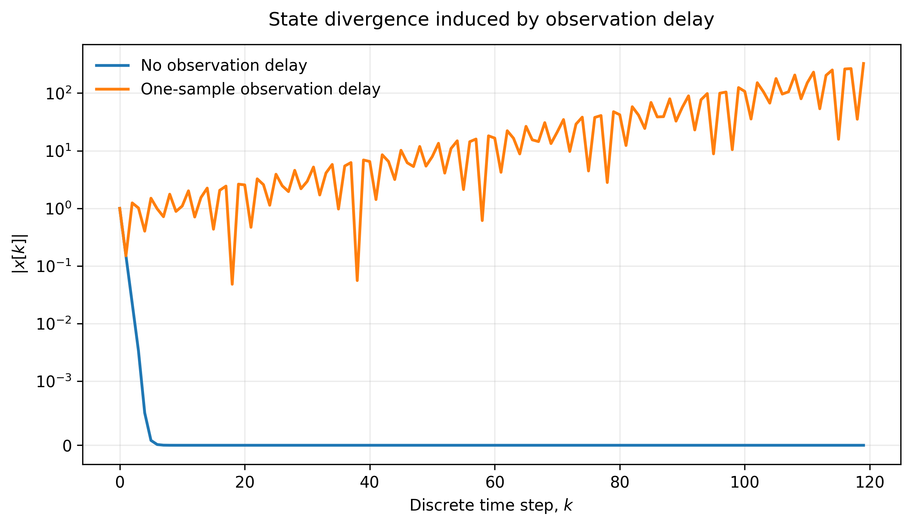
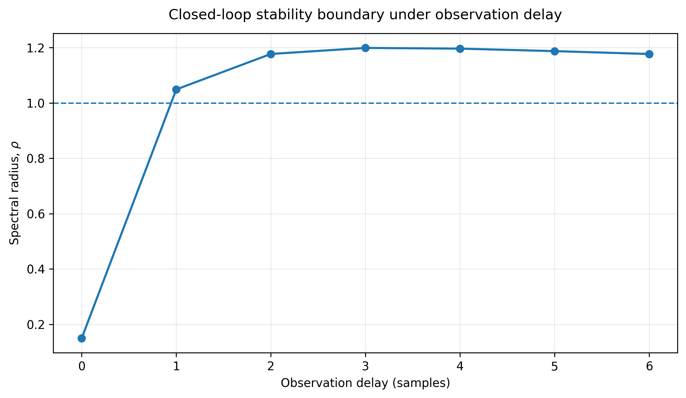
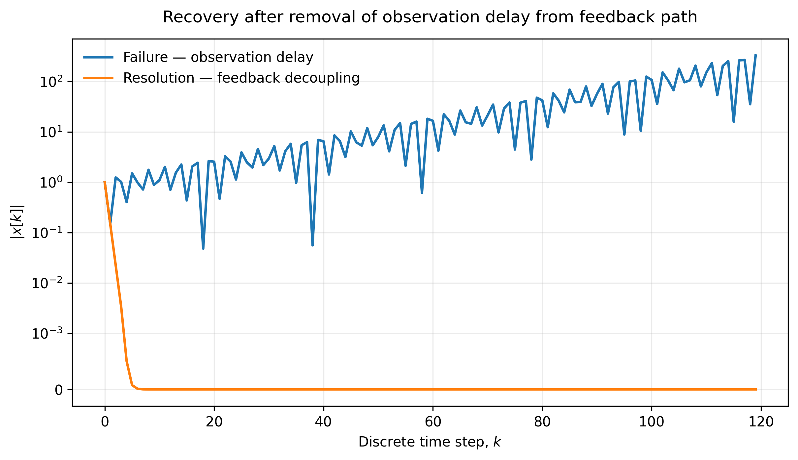

# CASE-001 — THE OBSERVER EFFECT

## A deterministic closed-loop instability induced by one-sample observation delay

**Aevumard // Public Transmissions**

---

## Abstract

CASE-001 studies a discrete-time feedback system that is stable under direct state observation but becomes unstable when the observation entering the feedback path is delayed by a single sample.

The baseline configuration has spectral radius **0.150000000**, while the one-sample delayed configuration has spectral radius **1.048808848**.

The simulated failure reaches a maximum absolute state magnitude of **326.303262296441**.

Two interventions restore convergence: feedback decoupling and one-step prediction.

---

## 1. Problem Statement

The investigated system is intentionally minimal.

Plant:

x[k+1] = A x[k] + B u[k]

Feedback:

u[k] = -K x_hat[k]

Canonical parameters:

- A = 0.95
- B = 0.1
- K = 11.0
- N = 120

Under direct observation:

x_hat[k] = x[k]

Under one-sample delayed observation:

x_hat[k] = x[k-1]

---

## 2. Baseline Stability

Without observation delay:

A - B*K = -0.150000

Therefore the baseline spectral radius is:

rho = 0.150000000

The baseline is stable and the state converges to zero.

*Figure 1. Baseline convergence versus delayed-feedback divergence.*

---

## 3. Delay-Induced Instability

With one-sample observation delay, the augmented state matrix is:

[[ 0.95, -1.1 ],
 [ 1.00,  0.0 ]]

Its spectral radius is:

rho = 1.048808848

Since rho > 1, the delayed closed-loop system is unstable.

*Figure 2. Spectral radius across observation delays.*

---

## 4. Delay Sweep

| delay | rho | stable |
|---:|---:|:---:|
| 0 | 0.150000 | True |
| 1 | 1.048809 | False |
| 2 | 1.176913 | False |
| 3 | 1.198712 | False |
| 4 | 1.196151 | False |
| 5 | 1.187140 | False |
| 6 | 1.176748 | False |

The stability classification changes immediately when one sample of delay is introduced.

---

## 5. Gain Sweep

| K | no_delay | delay_1 |
|---:|---:|---:|
| 2 | 0.750000 | 0.635078 |
| 4 | 0.550000 | 0.632456 |
| 6 | 0.350000 | 0.774597 |
| 8 | 0.150000 | 0.894427 |
| 10 | 0.050000 | 1.000000 |
| 11 | 0.150000 | 1.048809 |
| 12 | 0.250000 | 1.095445 |

The data do not support gain magnitude alone as a sufficient explanation for the observed transition.

---

## 6. Initial-Condition Sweep

| x0 | max_abs | final_abs |
|---:|---:|---:|
| 0.01 | 3.263033 | 3.263033 |
| 0.10 | 32.630326 | 32.630326 |
| 1.00 | 326.303262 | 326.303262 |
| 10.00 | 3263.032623 | 3263.032623 |

The initial condition changes the amplitude of the response but does not remove the unstable regime.

---

## 7. Minimum Intervention

Two stabilizing interventions were tested.

### A — Feedback Decoupling

The delayed telemetry signal is removed from the feedback-critical path.

Result:

- max |x| = 1.000000000000
- final |x| = 0.000000000000
- stable = True

### B — One-Step Predictor

The observation delay is mathematically compensated using a one-step predictor.

Result:

- max |x| = 1.000000000000
- final |x| = 0.000000000000
- stable = True

*Figure 3. Resolution of the delayed-feedback failure.*

---

## 8. Predictor Robustness

| model_error | max_abs | final_abs | stable |
|---:|---:|---:|:---:|
| 0% | 1.000000 | 0.000000 | True |
| 0.5% | 1.000000 | 0.000000 | True |
| 1% | 1.000000 | 0.000000 | True |
| 2% | 1.000000 | 0.000000 | True |
| 5% | 1.000000 | 0.000000 | True |
| 10% | 1.000000 | 0.000000 | True |
| 20% | 1.000000 | 0.000000 | True |

All tested predictor configurations remain stable within the evaluated range.

---

## 9. Hypothesis Falsification

### H1 — Delay does not matter

Rejected. Stability changes from rho = 0.150000000 at delay 0 to rho = 1.048808848 at delay 1.

### H2 — High gain is the sole cause

Not supported as a sufficient explanation. The gain sweep shows that the delayed and non-delayed systems have different stability boundaries.

### H3 — Initial condition is the cause

Rejected. The divergence persists across all tested nonzero initial conditions.

### H4 — Measurement noise is the cause

Rejected. The benchmark is deterministic and reproduces the instability without stochastic forcing.

---

## 10. Conclusion

CASE-001 demonstrates a deterministic transition from stable to unstable closed-loop behavior caused by a one-sample observation delay.

The central mechanism is the change in the closed-loop dynamics caused by delayed observation.

The case is reproducible from the frozen benchmark artifacts contained in the repository.

---

## Reproducibility

benchmarks:

- benchmark/delay_sweep.csv
- benchmark/gain_sweep.csv
- benchmark/initial_condition_sweep.csv
- benchmark/predictor_model_scaling_test.csv

data:

- data/baseline.csv
- data/telemetry_failure.csv
- data/resolved_decoupled.csv
- data/resolved_predictor.csv

figures:

- figures/fig01_state_divergence.png
- figures/fig02_stability_boundary.png
- figures/fig03_resolution.png

evidence:

- evidence/01_baseline_vs_failure.png

---

**AEVUMARD // PUBLIC TRANSMISSIONS**

---

## Public Case Archive

### Data

- [Delay sweep](benchmark/delay_sweep.csv)
- [Gain sweep](benchmark/gain_sweep.csv)
- [Initial-condition sweep](benchmark/initial_condition_sweep.csv)
- [Predictor robustness](benchmark/predictor_model_scaling_test.csv)

### Figures

- [Figure 1 — State divergence](figures/fig01_state_divergence.png)
- [Figure 2 — Stability boundary](figures/fig02_stability_boundary.png)
- [Figure 3 — Resolution](figures/fig03_resolution.png)

### Evidence

- [Baseline vs. failure evidence](evidence/01_baseline_vs_failure.png)

### Source

The public source directory contains the clean reproduction foundation used for the case.

- [Clean reproduction source](source/)

### Frozen Tables

- [Table 01 — Delay stability](paper/tables/table01_delay_stability.md)
- [Table 02 — Gain sweep](paper/tables/table02_gain_sweep.md)
- [Table 03 — Initial-condition sweep](paper/tables/table03_initial_condition_sweep.md)
- [Table 04 — Predictor robustness](paper/tables/table04_predictor_robustness.md)

---

**CASE-001 // Aevumard Public Transmissions**
